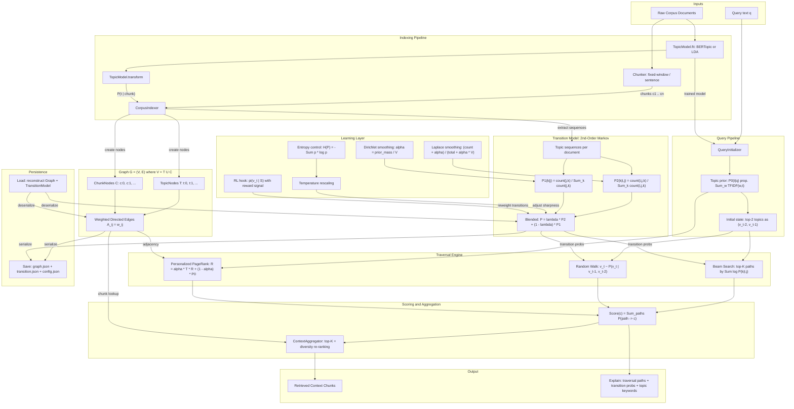

BetterMem
=========

BetterMem is an experimental Python library that implements a
probabilistic topic transition graph for retrieval. It treats knowledge
navigation as a discrete stochastic process over a graph of topic and
chunk nodes rather than pure vector similarity search.

High-level features:

- Second-order Markov transitions over topic sequences.
- Interpretable traversal paths via beam search and random walks.
- Personalized PageRank over the topic graph.
- Pluggable topic modeling backends (e.g. BERTopic, LDA).

The public entry point is the `BetterMem` client:

```python
from bettermem import BetterMem

client = BetterMem()
# client.build_index(corpus)
# results = client.query("Explain transformer attention")
```

For a more complete, runnable console demo, see `demo/basic_usage.py`:

```bash
uv run python demo/basic_usage.py
```

Traversal strategies
--------------------

When you run a query, BetterMem explores the topic graph to find relevant chunks. You can choose how that exploration works via `traversal_strategy` in config or the `strategy` argument to `query()`. Each strategy has different trade-offs.

| Strategy | Best for | Behavior |
|----------|----------|----------|
| **beam** | Interpretable, deterministic results | Keeps the top-K highest-probability paths through the graph. Paths are built step-by-step using the learned topic transitions; only the most likely continuations are kept. |
| **random_walk** | Exploratory, single coherent path | Takes one stochastic walk through the graph, sampling the next topic from the transition model. Good when you want variety across queries or a single “storyline” of topics. |
| **personalized_pagerank** | Balanced relevance and coverage (default) | Spreads relevance from your query’s topic prior over the whole graph via repeated propagation. Produces a steady-state importance score per node rather than explicit paths. |

**When to use which**

- **beam** — Use when you care about *why* something was retrieved. You get explicit paths (topic → topic → …) and can inspect them with `path_trace=True` and `explain()`. Results are deterministic for the same query and index. Tune with `beam_width` (more paths = more coverage, more cost) and `max_steps`.
- **random_walk** — Use when you want one coherent trail through the corpus or more diversity between repeated queries. Increase `exploration_factor` to make the walk less greedy and more exploratory. Paths are available in the explanation when `path_trace=True`.
- **personalized_pagerank** — Use as the default when you want a good balance of relevance and coverage without caring about a single path. It uses your full topic prior (all query-relevant topics) and the graph’s link structure. No path trace; explanations focus on the prior and strategy. Tune with `max_steps` (PageRank iterations).

Example: set the default strategy when creating the client:

```python
from bettermem import BetterMem
from bettermem.api.config import BetterMemConfig

client = BetterMem(
    config=BetterMemConfig(traversal_strategy="beam", beam_width=8)
)
# Or override per query:
# results = client.query("your question", strategy="random_walk", path_trace=True)
```

Architecture
------------



Testing
-------

This project uses `pytest` and is configured for the `uv` package manager.

- **Install dependencies with dev extras (includes pytest):**

  ```bash
  uv sync --extra dev
  ```

- **Run the full test suite:**

  ```bash
  uv run pytest
  ```

- **Run a single test file (example):**

  ```bash
  uv run pytest tests/test_transition_and_traversal.py
  ```