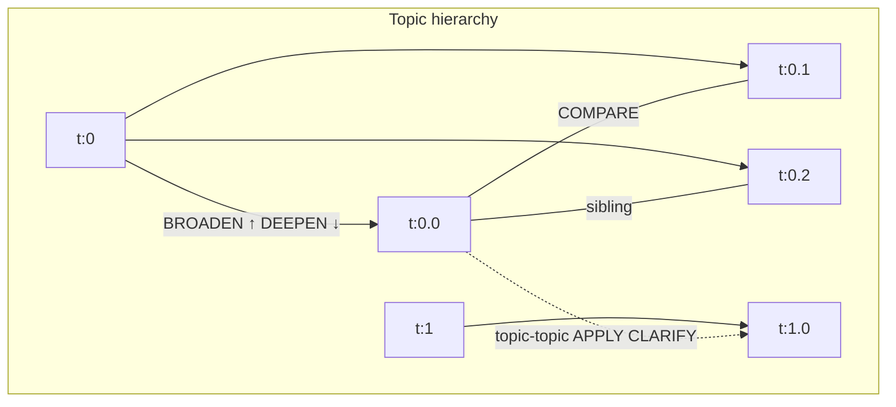
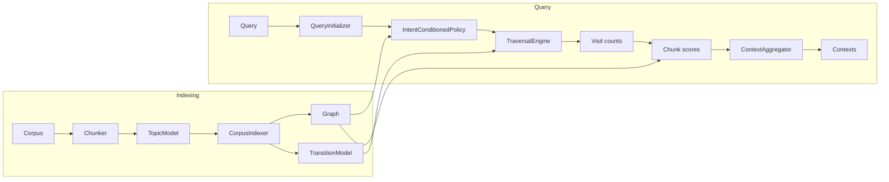

# BetterMem

BetterMem is a Python library for **intent-conditioned retrieval** over a semantic topic graph. Instead of pure vector search, it models navigation as a discrete process over topic and chunk nodes: you run a query, the system infers or uses a chosen intent (deepen, broaden, compare, apply, clarify, neutral), and a single policy steers a multi-step walk over the graph. Retrieved chunks come from the topics visited, with scoring that respects the graph structure.

## Features

- **Semantic hierarchical topic model**: Embeddings + recursive KMeans build a multi-level topic tree. Topics use path-style IDs (e.g. `t:0`, `t:0.1`, `t:0.1.2`). The model exposes leaves, parents, hierarchy, centroids, and query/chunk distributions (cosine similarity + temperature) for priors and navigation.
- **Intent-conditioned navigation**: A single policy scores the next topic at each step. The **intent** restricts or prefers graph relations (child, parent, sibling, semantic neighbor). Start nodes are chosen from the leaf prior so each intent has room to move (e.g. BROADEN starts at a leaf to ascend; DEEPEN starts at a mid-level node to descend). Hard filters apply every step with fallbacks so the walk does not die.
- **Graph and scoring**: The indexer builds topic nodes, chunk nodes, parent–child edges, **topic–chunk** edges (top leaves per chunk + ancestor decay for recall), structural chunk–chunk edges, and **topic–topic** semantic edges (centroid kNN). Visit counts from the walk are turned into chunk scores by projecting through topic→chunk edges with **per-topic normalization** so root-level topics do not dominate. Optional rerank blends topic score with query–chunk cosine.
- **Transition model**: Second-order Markov transitions over topic sequences (smoothed) can be blended with the policy at query time (configurable).

## Quick start

```python
from pathlib import Path
from bettermem import BetterMem
from bettermem.api.config import BetterMemConfig
from bettermem.indexing.chunker import ParagraphSentenceChunker
from bettermem.topic_modeling.semantic_hierarchical import SemanticHierarchicalTopicModel

config = BetterMemConfig.debug_preset()  # or BetterMemConfig()
topic_model = SemanticHierarchicalTopicModel(n_coarse=10, n_fine_per_coarse=4, random_state=42)
chunker = ParagraphSentenceChunker(max_tokens=200)
client = BetterMem(config=config, topic_model=topic_model)

corpus = [Path("doc.txt").read_text()]
client.build_index(corpus, chunker=chunker)

results = client.query("attention mechanism transformer training", top_k=5, path_trace=True)
# client.explain() → intent, path, prior, path_steps, chunks_along_path
```

Full demo (Attention Is All You Need paper, all intents):

```bash
uv run python demo/basic_usage.py
```

## Intents

Navigation prefers the following graph relations; when no candidate matches, structured fallbacks keep the walk going (e.g. BROADEN at root can move to siblings or same-level topics; DEEPEN at a leaf can jump to a parent’s sibling with children).

| Intent     | Preferred relation   | Use case |
|-----------|----------------------|----------|
| **deepen**  | Child (subtopic)     | More detail or a deeper explanation. |
| **broaden** | Parent (broader)     | Big picture, overview, or context. |
| **compare** | Sibling (same parent)| Compare alternatives or related concepts at the same level. |
| **apply**   | Semantic neighbor    | Applications, examples, or related domains. |
| **clarify** | Semantic neighbor (high similarity) | Closely related explanation when the topic is unclear. |
| **neutral** | None                 | Relevance and continuity only; general retrieval. |

**Policy** (each step):  
`Score(k) = α·cos(μ_k, q) + β·cos(μ_k, μ_i) + γ·R_intent(i,k) + novelty_bonus + prior_weight·prior(k) − repetition_penalty − backtrack_penalty`  

Relation type is determined by the **hierarchy first** (parent / child / sibling), then by edge kind (topic–topic semantic). Intent is inferred from the query or set explicitly: `query(..., intent=TraversalIntent.DEEPEN)`.

## Navigation graph (conceptual)

Topics form a tree (or DAG if `dag_tau` is set); path IDs reflect depth (e.g. `t:0`, `t:0.0`, `t:0.1`, `t:0.0.0`). Siblings share a parent; topic–topic edges connect semantically similar topics across the tree.



## Architecture (simplified)

- **Indexing**: Corpus → chunker (e.g. `ParagraphSentenceChunker`) → topic model `fit` / `transform` (embeddings, recursive clustering, P(leaf|chunk) with cosine + temperature) → **CorpusIndexer** adds topic and chunk nodes, topic–chunk edges (top leaves + ancestor decay), structural chunk edges, topic–topic semantic edges, and builds topic sequences for the transition model.
- **Transition model**: Second-order (and first-order) counts over topic sequences; smoothing (e.g. additive) from `bettermem.learning`; blended P(k|i,j) and P(k|j).
- **Query**: **QueryInitializer** produces leaf-based topic prior and rolled-up prior; start node and intent set from leaf prior. **IntentConditionedPolicy** filters candidates by intent (with fallbacks), scores them, softmax (greedy or sampled). **TraversalEngine** runs the walk; optionally blends policy with Markov transition.
- **Scoring**: Visit counts → **QueryScorer** → **scores_to_chunk_space** (topic scores projected to chunks via topic–chunk edges, **normalized per topic** so each topic contributes a fixed budget) → optional rerank (topic + query–chunk cosine) → **ContextAggregator** (top-k, optional diversity / windows).



## Persistence

- **Save**: `client.save(path)` writes `graph.joblib`, `transition.joblib`, and optional `config.json`.
- **Load**: `BetterMem.load(path)` reconstructs the graph and transition model; no topic model is loaded (query uses uniform topic prior if needed). Reloaded client can query and return chunks as usual.

## Testing

```bash
uv sync --extra dev
uv run pytest
```

## Package layout

- **`bettermem.api`**: `BetterMem` client and `BetterMemConfig`.
- **`bettermem.core`**: Graph, nodes (topic/chunk/keyword), edges, transition model, **intent-conditioned policy**, traversal engine.
- **`bettermem.topic_modeling`**: `BaseTopicModel`, `SemanticHierarchicalTopicModel` (recursive clustering, path IDs, leaves, hierarchy, centroids, transform with cosine+temp).
- **`bettermem.indexing`**: Chunker, `CorpusIndexer` (hierarchical topic–chunk edges, structural and semantic edges).
- **`bettermem.retrieval`**: Query initializer (leaf prior, start node, rolled prior), scorer, context aggregator, intent/relation helpers.
- **`bettermem.learning`**: Smoothing and related utilities used by the transition model.
- **`bettermem.storage`**: Save/load index (joblib + config).

Each subpackage may contain a short `README.md` describing its role and main types.
