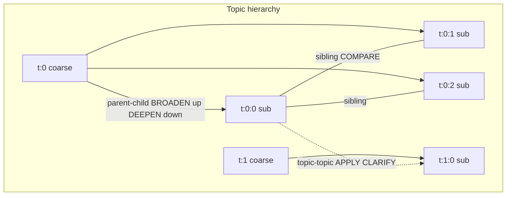
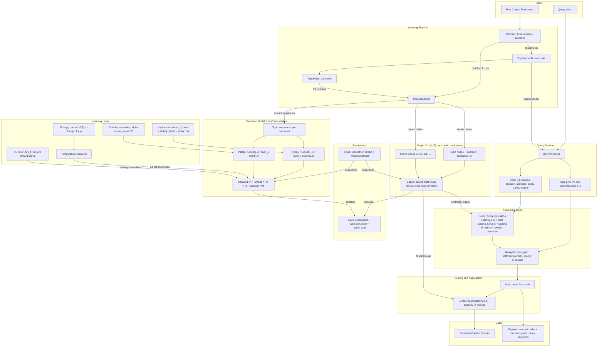

BetterMem
=========

BetterMem is an experimental Python library that implements a
probabilistic topic transition graph for retrieval. It treats knowledge
navigation as a discrete stochastic process over a graph of topic and
chunk nodes rather than pure vector similarity search.

High-level features:

- **Intent-conditioned navigation**: goal-directed traversal in semantic space conditioned on user intent (deepen, broaden, compare, apply, clarify), approximating textbook-style browsing.
- Graph built from embedding space: topic centroids, parent-child hierarchy, and semantic (topic-topic) edges.
- Single policy P(v_{t+1} | v_t, I_t, S_t) with scoring: relevance + structural fit + novelty (repetition penalty).
- Semantic hierarchical topic model (embeddings + two-level clustering) for graph building and query priors.

The public entry point is the `BetterMem` client:

```python
from bettermem import BetterMem

client = BetterMem()
# client.build_index(corpus)
# results = client.query("Explain transformer attention")
```

For a more complete, runnable console demo, see `demo/basic_usage.py`:

```bash
uv run python demo/basic_usage.py
```

Intent-conditioned navigation
------------------------------

When you run a query, BetterMem navigates the topic graph using a **single policy** conditioned on your query and inferred **intent**. The policy scores each candidate next topic and chooses by softmax (greedy or sampled). This mirrors textbook browsing: choose a topic, then go deeper, broaden, compare alternatives, or clarify.

| Intent    | Graph relation preferred     | Basis |
|-----------|------------------------------|--------|
| **deepen**  | **Child** (subtopic of current) | Move to more specific subtopics; use when the user wants more detail or a deeper explanation. |
| **broaden**  | **Parent** (coarse topic of current) | Move to the broader topic; use for big picture, overview, or context. |
| **compare**  | **Sibling** (same parent as current) | Move to sibling subtopics; use to compare alternatives or related concepts at the same level. |
| **apply**    | **Semantic neighbor** (topic-topic edge) | Move to semantically related topics; use for applications, examples, or related domains. |
| **clarify**  | **Semantic neighbor** (high similarity) | Same as apply in structure; use when the current topic is unclear and the user wants a related explanation. |
| **neutral**  | None (relevance + continuity only) | No structural bias; next topic by relevance to the query and continuity with the current topic. |

**Policy** (at each step):  
Score(k) = α·cos(μ_k, q) + β·cos(μ_k, μ_i) + γ·R_intent(i,k) + novelty_bonus + prior_weight·prior(k) − repetition_penalty − backtrack_penalty.  
Scores are softmax-normalized; next node is argmax (greedy) or sampled. Intent is inferred from query text or set via `query(..., intent=TraversalIntent.DEEPEN)`.

### Navigation graph (conceptual)

Topic nodes and relation types form the graph that intents steer over: coarse topics have subtopics (child nodes); siblings share a parent; topic–topic edges connect semantically similar topics (centroid similarity).



Example:
Example: configure policy weights and use path trace:

```python
from bettermem import BetterMem
from bettermem.api.config import BetterMemConfig

client = BetterMem(
    config=BetterMemConfig(
        navigation_alpha=0.5,
        navigation_gamma=0.5,
        navigation_temperature=0.8,
        navigation_greedy=False,
    )
)
results = client.query("explain more about attention", path_trace=True)
# client.explain() includes "intent" and "paths"
```

Architecture
------------



Index directories use joblib for the graph and transition model
(`graph.joblib`, `transition.joblib`). Optional `config.json` holds human-readable config.

Testing
-------

This project uses `pytest` and is configured for the `uv` package manager.

- **Install dependencies with dev extras (includes pytest):**

  ```bash
  uv sync --extra dev
  ```

- **Run the full test suite:**

  ```bash
  uv run pytest
  ```

- **Run a single test file (example):**

  ```bash
  uv run pytest tests/test_transition_and_traversal.py
  ```